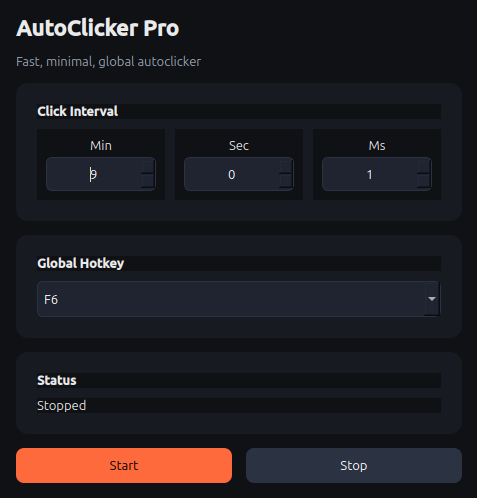

# AutoClicker Pro

A lightweight, fast, and minimal autoclicker for **Linux X11** written in Python using **PyQt6**.


> **⚠️ This project is Linux-only and is designed specifically for X11.**
>
> It **does not support Windows, macOS, or Wayland**.

## Features

* Global hotkey (F1–F12)
* Adjustable click interval

  * Minutes
  * Seconds
  * Milliseconds
* Lightweight PyQt6 interface
* Native X11 mouse click injection
* Configuration saved automatically
* Minimal dependencies

## Requirements

### Operating System

* Linux
* **X11 session**

This application uses native X11 APIs (`libX11` and `libXtst`) for global hotkeys and mouse click injection.

It **will not work** on:

* ❌ Windows
* ❌ macOS
* ❌ Wayland sessions

## Python Requirements

* Python 3.10 or newer (recommended)

Install the required Python packages:

```bash
pip install -r requirements.txt
```

or

```bash
pip install PyQt6 python-xlib
```

## System Dependencies

### Ubuntu / Debian

```bash
sudo apt install libx11-6 libxtst6
```

### Arch Linux

```bash
sudo pacman -S libx11 libxtst
```

### Fedora

```bash
sudo dnf install libX11 libXtst
```

## Installation

Clone the repository:

```bash
git clone https://github.com/USERNAME/REPOSITORY.git
cd REPOSITORY
```

(Optional) Create a virtual environment:

```bash
python3 -m venv .venv
source .venv/bin/activate
```

Install dependencies:

```bash
pip install -r requirements.txt
```

Run the application:

```bash
python main.py
```

## Usage

1. Launch the application.
2. Select the click interval.
3. Choose a global hotkey (F1–F12).
4. Press **Start** or use the selected hotkey.
5. Press the hotkey again (or **Stop**) to stop clicking.

Settings are automatically saved to `config.json`.

## Why X11 Only?

AutoClicker Pro directly interfaces with X11 using:

* `libX11`
* `libXtst`
* `python-xlib`

These libraries provide native mouse click injection and global keyboard grabbing.

Modern Wayland compositors intentionally restrict applications from performing these actions for security reasons, so this application is **not compatible with Wayland**.

## Project Structure

```
.
├── main.py
├── requirements.txt
├── config.json
├── core/
│   ├── clicker.py
│   ├── config.py
│   ├── hotkey.py
│   └── x11_click.py
└── ui/
    └── ...
```

## License

This project is open source. Feel free to modify and distribute it under the terms of the license included with this repository.

## Disclaimer

This software is intended for automation and accessibility purposes. Users are responsible for ensuring they comply with the terms of service of any software or games in which they choose to use it.
